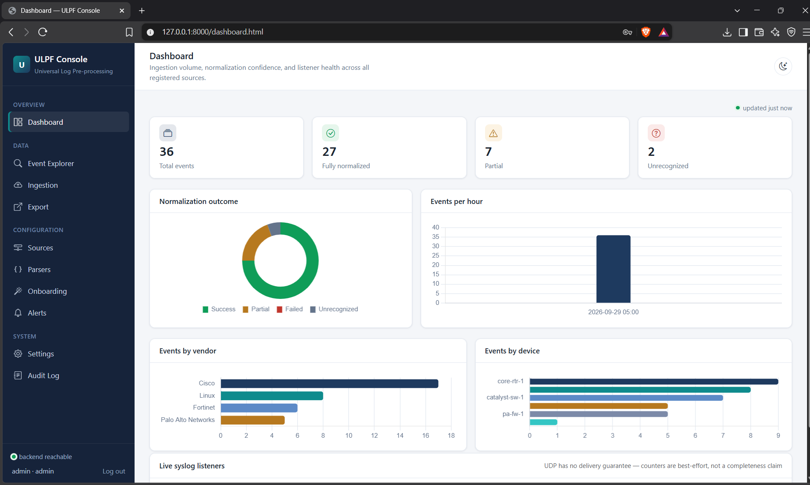
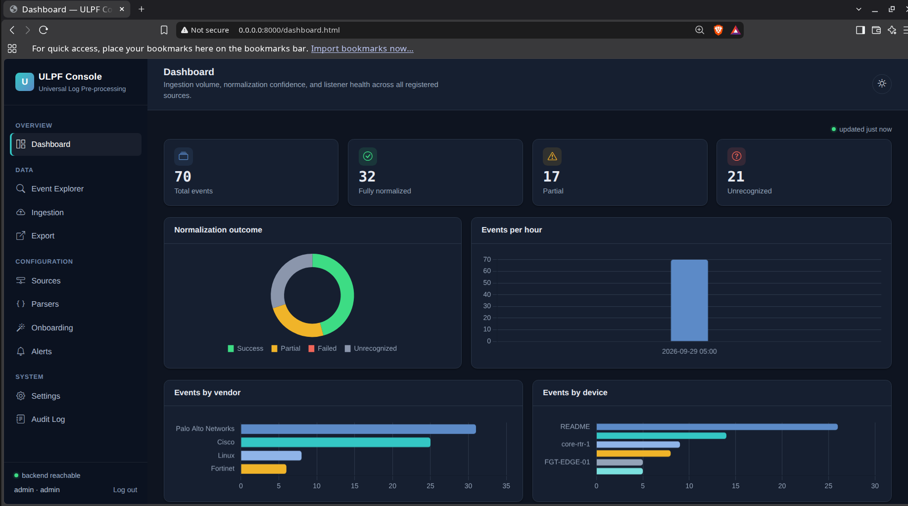
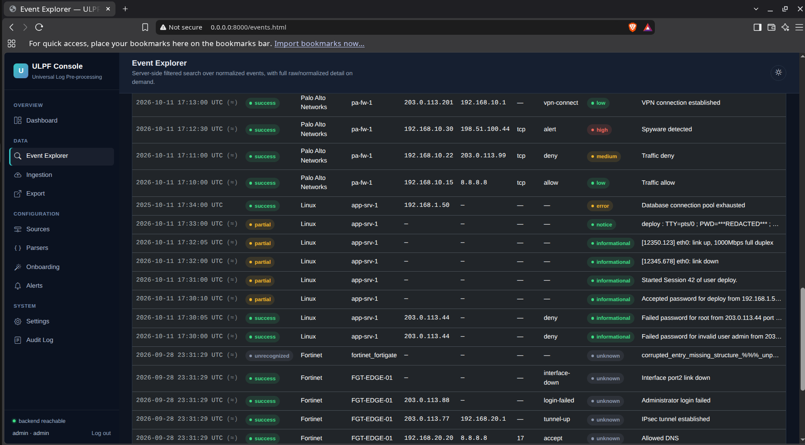
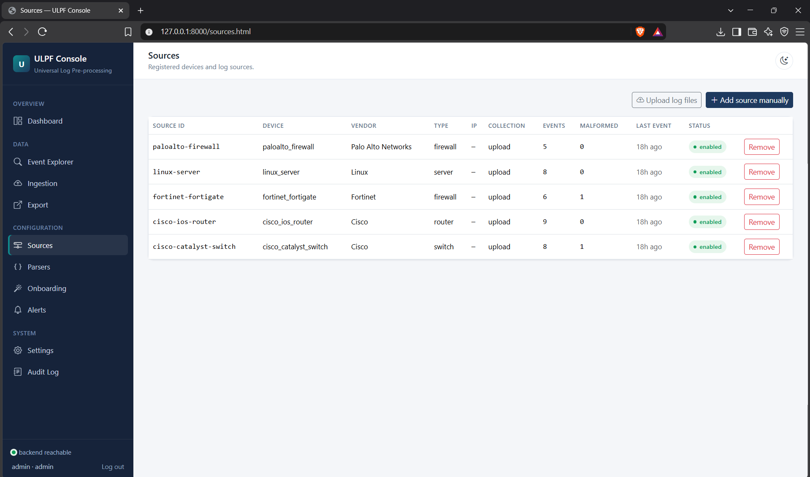

<div align="center">

# ULPF — Universal Log Pre-processing Framework

**A vendor-agnostic pipeline that turns heterogeneous network and security logs into one normalized, searchable, exportable stream — without ever discarding the original.**

[](https://www.python.org/)
[](https://fastapi.tiangolo.com/)
[](https://www.sqlalchemy.org/)
[](https://getbootstrap.com/)
[](https://www.chartjs.org/)
[](#testing)
[](#quick-start-docker--recommended)
[](#license)

[Overview](#overview) · [Features](#features) · [Screenshots](#screenshots) · [Quick Start](#quick-start-docker--recommended) · [Architecture](#architecture) · [API](#api-reference) · [Testing](#testing) · [Docs](#documentation)

</div>

---

## Overview

Every vendor logs differently. Cisco emits `%FACILITY-SEVERITY-MNEMONIC`
syslog mnemonics, Fortinet uses native `key=value` pairs, Palo Alto speaks
CEF, and application servers ship raw JSON. A SOC analyst or downstream
SIEM either maintains one bespoke parser per vendor forever, or drowns in
inconsistent field names (`src` vs. `srcip` vs. `source_ip`) that make
correlation and search unreliable.

**ULPF is a single, extensible pipeline** that ingests any of these formats
— via file upload or live UDP/TCP syslog — preserves the original event
byte-for-byte with a verifiable integrity hash, and normalizes it into one
common, versioned JSON schema. It ships with a REST API, a role-based web
console, and an offline AI-assisted onboarding flow for formats it doesn't
recognize yet.

This is a working prototype, not a mockup: every capability listed below
was implemented and verified by actually running it — see
[`docs/evaluation_checklist.md`](docs/evaluation_checklist.md) for a
requirement-by-requirement account, evidenced by the automated test suite.

---

## Features

| | |
|---|---|
| 🔌 **8 auto-detecting parsers** | Syslog (with Cisco mnemonic extraction), JSON, CSV, XML, CEF, LEEF, generic key=value, and a never-fail generic fallback — chosen by confidence scoring, extensible by adding one file |
| 🧬 **Lossless raw preservation** | Every original event is stored verbatim with a SHA-256 hash, recomputed (not just stored) on every read |
| 🗂️ **Versioned common schema** | JSON-Schema-validated normalized events with honest confidence levels (`success` / `partial` / `failed` / `unrecognized`) — never overclaims |
| 📡 **Live + batch ingestion** | UDP and TCP syslog listeners, single/bulk file upload, and one-click "upload log files → auto-create source → ingest" onboarding |
| 🔍 **Server-side search** | Filtered, paginated event explorer with full raw/normalized side-by-side detail view |
| 🤖 **Offline AI-assisted onboarding** | Deterministic, local heuristic suggests field mappings for unknown formats — no network call, no paid API, always human-approved before use |
| 🔐 **RBAC + redaction** | Viewer / analyst / admin roles enforced on destructive actions and raw-log access; configurable masking of sensitive fields in views and exports |
| 📤 **SIEM-ready export** | JSON and streaming JSONL, schema-versioned and filterable |
| 📊 **Visual dashboard** | Chart.js-powered normalization breakdown, vendor/device distribution, and ingestion trend, in a light-by-default / dark-toggle console |
| 🐳 **Deploy anywhere** | Docker Compose, Alembic-managed migrations, SQLite by default (PostgreSQL via one env var), fully functional air-gapped |

---

## Screenshots

> The console defaults to a light theme for a clean, formal presentation,
> with a one-click dark mode toggle in the top bar.

| Dashboard (light) | Dashboard (dark) |
|---|---|
|  |  |

| Event Explorer | Sources — bulk log upload |
|---|---|
|  |  |

---

## Quick Start (Docker — recommended)

```bash
git clone https://github.com/dhanusiya-2609/sih-2026-ulpf.git
cd sih-2026-ulpf
cp .env.example .env        # edit ULPF_ADMIN_PASSWORD and ULPF_JWT_SECRET
docker compose up --build
```

Open **http://localhost:8000** and sign in (`admin` / the password you
set, default `admin123`). Migrations run automatically on container start.

## Quick Start (without Docker)

```bash
cd backend
python3 -m venv .venv && source .venv/bin/activate
pip install -r requirements.txt
alembic upgrade head
uvicorn app.main:app --host 0.0.0.0 --port 8000
```

Live syslog listeners start automatically on UDP/TCP port `5514`/`5515`
(configurable via `.env`, or disable with `ULPF_ENABLE_UDP=false` /
`ULPF_ENABLE_TCP=false`).

## Try it in under a minute

Five synthetic, labeled sample log files ship in [`sample_logs/`](sample_logs/)
(Cisco IOS router, Cisco Catalyst switch, Palo Alto firewall, Fortinet
FortiGate, Linux server). In the console: **Sources → Upload log files**,
drop in any of them — a source is created automatically from the filename
and every event is ingested and normalized in one step.

---

## Architecture

```
                          ┌─────────────────────────┐
  File upload  ────────►  │                         │
  UDP syslog   ────────►  │   process_single_event  │   one pipeline,
  TCP syslog   ────────►  │                         │   three entry points
                          └───────────┬─────────────┘
                                      │
                     1. Raw event stored verbatim + SHA-256 hash
                     2. Parser registry auto-detects format by confidence,
                        never raises — falls back to a generic parser
                     3. Normalization maps vendor fields onto the common
                        schema, parses timestamps, reconciles severity
                        scales, and honestly downgrades confidence when
                        nothing meaningful was extracted
                     4. JSON-Schema validation pass (warnings recorded,
                        never blocks storage)
                                      │
                                      ▼
                     REST API (search · export · alerts) ── Web console
```

Full design rationale, component responsibilities, and documented
trade-offs: [`docs/architecture.md`](docs/architecture.md).

### Tech stack

| Layer | Choice | Why |
|---|---|---|
| Backend | FastAPI + SQLAlchemy 2 + Pydantic 2 | async-ready, typed, auto-generated OpenAPI docs at `/docs` |
| Database | SQLite (default) / PostgreSQL | zero-config for air-gapped deployment; swap via one env var |
| Migrations | Alembic | schema changes tracked and reproducible, not ad-hoc `create_all` |
| Auth | JWT (PyJWT) + `pbkdf2_sha256` (passlib) | stateless tokens, no native-extension password hashing surprises |
| Frontend | Bootstrap 5.3 + Chart.js 4, vanilla JS | formal, componentized UI with real data visualization — no build step, no CDN dependency (fully bundled for offline/air-gapped use) |
| Testing | pytest + FastAPI TestClient | 66 tests, run for real against an isolated SQLite DB per session |
| Packaging | Docker + Docker Compose | one command to a running stack, health-checked |

---

## API Reference

Interactive Swagger UI is served at **`/docs`** once the backend is
running. Key resource groups:

`/api/auth` · `/api/sources` · `/api/ingest` · `/api/events` ·
`/api/dashboard` · `/api/export` · `/api/parsers` · `/api/training` ·
`/api/alerts` · `/api/integrations` · `/api/settings` · `/api/audit-logs`

Public (no auth): `/api/health` (container health check),
`/api/schema/event` (the versioned universal event JSON Schema).

---

## Testing

```bash
cd backend
pip install -r requirements.txt
python3 -m pytest tests/ -v
```

**66 tests, all passing** — parser unit tests for every format, raw
preservation/integrity-hash tests, live UDP/TCP listener tests (exercising
the real listener code path), cross-vendor field-mapping consistency
tests, RBAC and redaction tests, and full API acceptance-criteria coverage.

---

## Security notes

- Change `ULPF_ADMIN_PASSWORD` and `ULPF_JWT_SECRET` before any deployment
  outside local development (see [`.env.example`](.env.example)).
- Three roles (`viewer` / `analyst` / `admin`) gate destructive operations
  and raw-log access; sensitive fields (passwords, tokens, secrets by
  default) are masked in views and exports without ever altering stored
  data — see `ULPF_REDACT_FIELDS`.
- The system makes no external network calls; it is designed to run fully
  air-gapped.
---

## Documentation

| Document | Contents |
|---|---|
| [`docs/architecture.md`](docs/architecture.md) | System design, data flow, component responsibilities, trade-offs |
| [`docs/evaluation_checklist.md`](docs/evaluation_checklist.md) | Requirement-by-requirement status with test evidence |
| [`sample_logs/README.md`](sample_logs/README.md) | What each sample log contains and expected parsing outcome |

## Known limitations

Stated plainly rather than hidden — see the full list with evidence in
[`docs/evaluation_checklist.md`](docs/evaluation_checklist.md):
UDP has no delivery guarantee (by protocol design, surfaced honestly via
counters); the ingestion pipeline runs synchronously (fine at prototype
scale, documented path to a queue-backed worker for production volume);
retention policy is configurable but not yet enforced by a background job;
Docker build was authored and its underlying commands verified, but not
build-tested with an actual Docker daemon in this project's authoring
environment.

## License

MIT — see [`LICENSE`](LICENSE).

## Contributing

Issues and pull requests are welcome. For a new log format, add one parser
class implementing `detect()`/`parse()` under `backend/app/parsers/` and
register it in `registry.py` — no other code needs to change.

## Thank You
